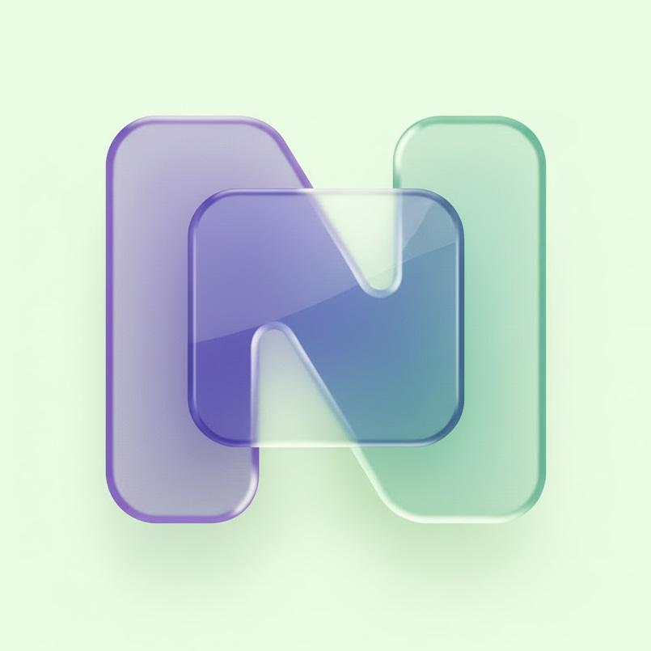

<p align="center">
  
</p>

<h1 align="center">Nozo</h1>

<p align="center">
  <strong>Effortless Link Previewing for Modern Browsers</strong>
</p>

<p align="center">
  Preview links instantly without leaving your current context. Nozo provides a seamless, secure, and lightweight modal window for peeking at content via drag-and-drop interactions.
</p>

<br>

## Overview

Nozo enhances your browsing workflow by allowing you to "peek" at links before navigating. Simply drag any link to the designated drop zone to open it in a non-intrusive modal overlay. Designed with security and performance in mind, Nozo ensures a safe and fluid experience.

## Key Features

*   **Seamless Interaction**: Drag and drop mechanic preventing accidental triggers.
*   **Security First**: Automatically sanitizes URLs and blocks unsafe protocols like `javascript:`.
*   **Privacy Focused**: Modifies necessary headers locally to allow standard framing without tracking or external servers.
*   **Lightweight**: Minimal resource footprint with no background processes when idle.

## Installation

### Firefox (Manual Install)
1. Download `nozo-firefox.xpi` from the [Releases](../../releases) page.
2. Go to `about:addons`.
3. Click on the cogwheel and select "Install Add-on From File...".
4. Select the downloaded `.xpi` file.
   > **Note**: As this is an unsigned extension, you will need to use **Firefox Developer Edition** / **Nightly** to install it permanently.
5. Type `about:config` in the address bar and accept the risk.
6. Search for `xpinstall.signatures.required`.
7. Toggle the value to `false`.

### Chrome / Edge / Brave (From Release)
1.  Navigate to the [Releases](../../releases) page.
2.  Download the `extension.zip` asset from the latest version.
3.  Extract the archive to a preferred location.
4.  Open your browser's extensions page (`chrome://extensions` or `edge://extensions`).
5.  Enable **Developer mode** in the top right corner.
6.  Select **Load unpacked** and choose the extracted folder.

### From Source
1.  Clone this repository:
    ```bash
    git clone https://github.com/RayZ3R0/nozo.git
    cd nozo
    ```
2.  Follow steps 4-6 above, selecting the repository root directory.

## Development

### Prerequisites
*   Node.js 18+
*   npm

### Setup
```bash
npm install
```

### Testing
We utilize **Jest** for unit testing and **Playwright** for robust End-to-End (E2E) validation.

```bash
# Run unit tests
npm test

# Run E2E tests (requires Chromium)
npx playwright install chromium
npm run test:e2e
```

### Packaging
To generate a production-ready artifact:

```bash
npm run pack
```
This command produces an optimized `extension.zip` in the project root, excluding development files.

## License

[MIT](LICENSE) © 2025 RayZ3R0
